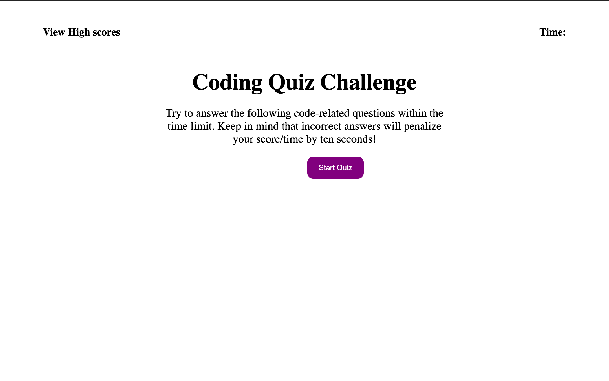
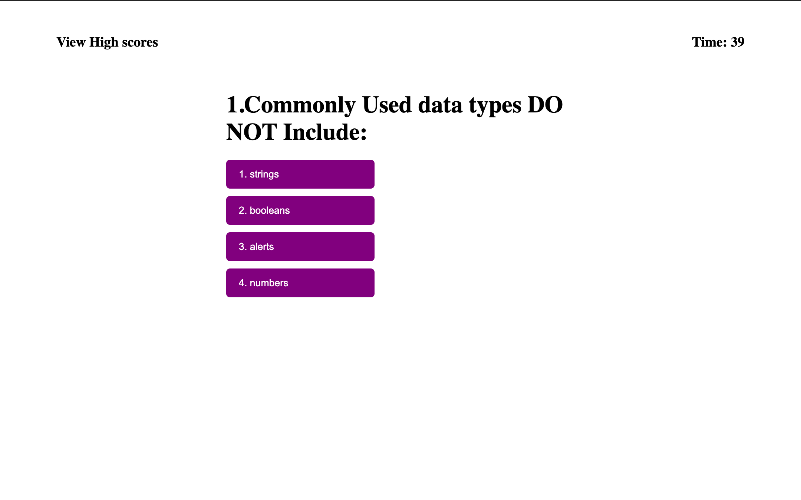
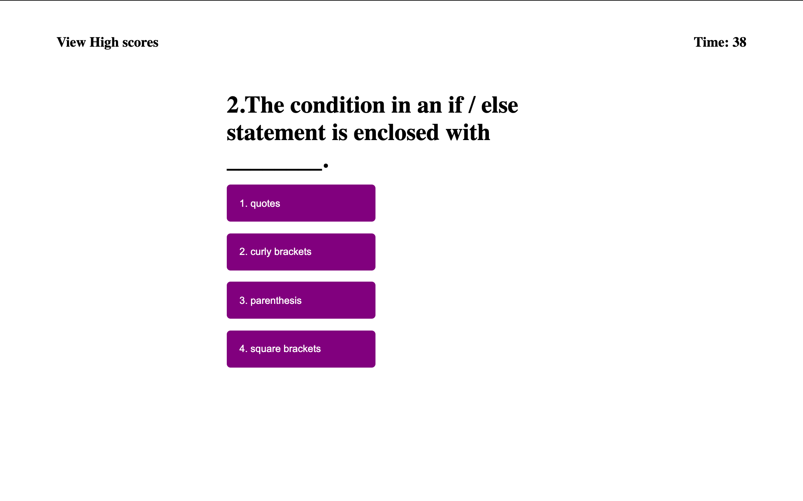
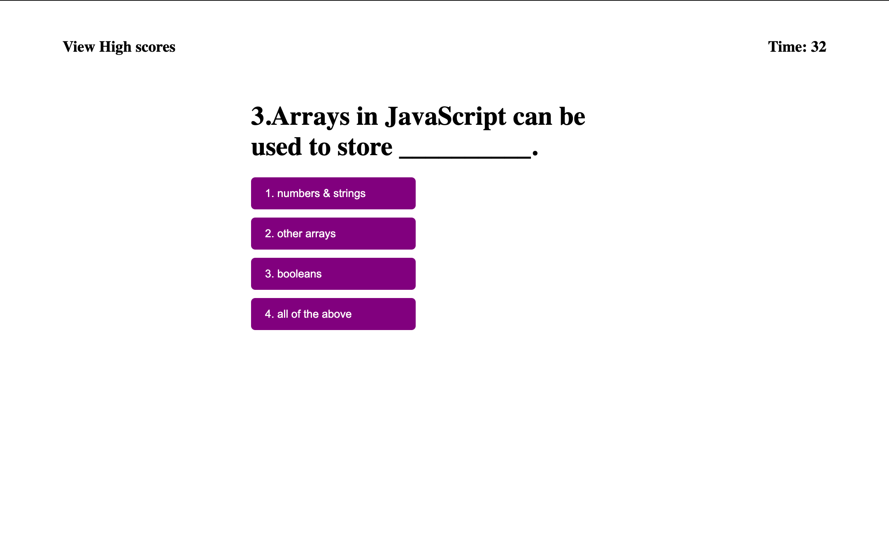
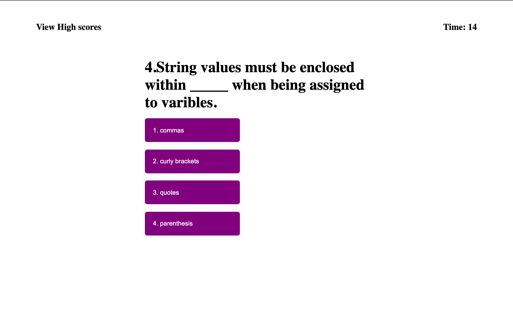
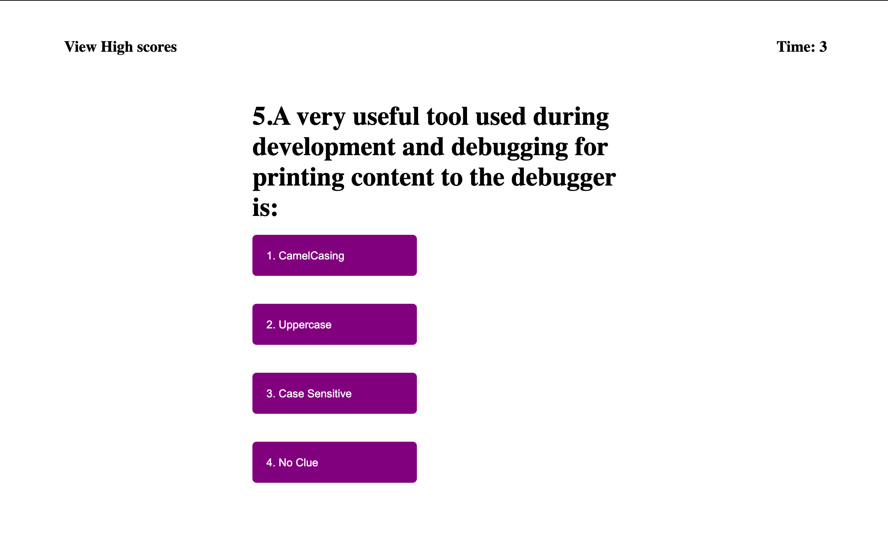

# Code Quiz

## -When user clicks "Start Quiz" a timer will begin and user will have 45 seconds to complete quiz. 
## -At the end of the quiz user can right click > Inspect > Console and view the console log of correct/incorrect for each question. 

# Link to Launch Website
[click here](https://brittnc.github.io/quiz/)

# Screenshots of Live Webpage

